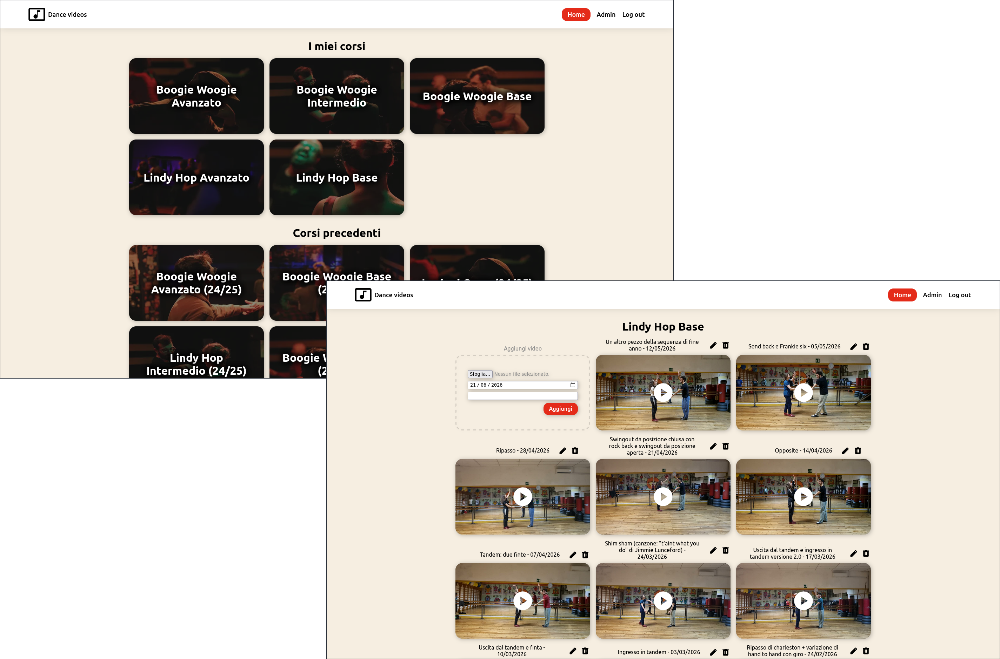

# Dance Videos Website

This is a selfhosted website for organizing video content by classes. It is
possible to create users with access restricted only to specific courses, which
allows them to see only the videos of said courses.



I created this website specifically for sharing the summary videos at the end of
each dance class, but it can of course be used for any type of group-based video
sharing.

## Usage

### Deployment

#### Running with Docker or Podman

Build the image, then run it with the data volumes mounted:

```sh
docker build -t dance-videos .

docker run -d --name dance-videos -p 3000:3000 \
  -v ./data:/data \
  -v ./storage:/storage \
  -v ./temp:/temp \
  -v ./logs:/logs \
  dance-videos
```

Podman is a drop-in replacement, just swap `docker` for `podman` in both
commands.

The mounted volumes are:

- `/data`, which keeps the users and courses metadata, as well as generated
  thumbnails
- `/storage`, which is the storage designated for the video files (if available,
  it's suggested to mount `/data` on fast memory and `/storage` on bulk storage)
- `/temp`, which keeps uploads in progress and the scratch files of the video
  conversion
- `/logs`, which as the name implies keeps the logs

During the first boot (or any time `/data` is missing the `users.json` file),
the backend bootstraps an `admin` user with a random password and prints it to
the logs, which you can inspect with:

```sh
docker logs dance-videos   # Initial admin created: username 'admin', password '...'
```

It is strongly suggested to change this password during the first login.

The spawned instance can be further personalized by mounting an additional
volume `/branding`, see [Customization](#customization).

#### With `just deploy`

`just deploy <site>` deploys a site to a remote machine over SSH. It needs:

- `sites/<site>/.env.deploy`, with the SSH user and host and the site's domain
- `sites/<site>/compose.yaml`, the compose file of the site
- optionally `sites/<site>/branding/`

See [`sites/example/`](./sites/example/) as a reference. On the remote machine,
the command syncs the repository to `~/src/dance-videos` and builds the image
`dance-videos:latest` from it. It then copies the compose file and the branding
to `~/<domain>` and runs `docker compose up -d` there. The data volumes of the
example compose file are folders inside `~/<domain>`.

All sites on the same machine share the same image. Deploying one site rebuilds
the image for all of them, and the other sites switch to it the next time their
container is recreated.

The remote machine needs rootless Docker running for the SSH user. On NixOS,
this means `virtualisation.docker.rootless.enable = true` and
`users.users.<user>.linger = true`, so that the containers start at boot without
a login. The [example nix module](./nixos/example.nix) shows the Caddy reverse
proxy in front of a site.

### Development

After `npm install`, you can start the whole stack with:

```sh
just dev
```

This runs the frontend and the backend dev servers in parallel. Use `just check`
to type-check and lint every package, and `just build` to produce the production
bundles in sequence (`shared` first, since the others depend on its generated
types). To see how a specific site looks fully branded (see
[Customization](#customization)), use `just preview <site>`.

> [!NOTE]
> **Dependencies disclaimer**
>
> The root `package.json` pins one dependency through `overrides`, to patch a
> security advisory that has (at the time of writing) no fix reachable through
> normal version ranges (build-time only):
>
> - **`esbuild`: `^0.28.1`**: `vite` `7.x` pins a vulnerable `esbuild`. Remove
>   once the project moves to `vite` `>=8`, whose `rolldown` bundler no longer
>   depends on `esbuild`.
>
> It should be dropped once its upstream ships a fix.

## Customization

The website has a neutral look by default. You can customize the appearance of
the website for example to add the name, logo and palette of your dance school
or institution. To brand an instance, provide a `branding/` directory (mounted
at `/branding`, see [Deployment](#deployment)) with this layout:

```
branding/
    branding.json     # textual branding, see definition below
    branding.css      # theme colours, see definition below
    assets/           # static files (omitted ones keep the baked default)
        logo.svg          # header logo, shown next to the logo text
        icon.png          # favicon
        og-image.png      # link-preview image for social/chat shares (1200x630)
        icon-192x192.png  # PWA home-screen icon (small)
        icon-512x512.png  # PWA home-screen icon (large)
        courses/          # course-card background images, any number of them. when present, it replaces the default set of images
```

`branding.json` holds the textual branding. Every field is optional:

```json
{
    "domain": "example.com",
    "title": "Example Dance School",
    "description": "Lesson videos for our courses.",
    "logoText": "Example"
}
```

`branding.css` overrides the theme colours. It is inlined into the page `<head>`
(so the branded palette is correct on first paint). Any missing color falls back
to a neutral default

```css
:root {
    --brand-primary: #e42b19;
    --brand-highlight: #e86c5f;
    --brand-primary-dark: #ba2314;
    --brand-background: #f6eee1;
}
```

Any CSS is allowed in this file (it cannot contain a `</style` sequence),
although overriding rules other than these variables may require `!important`.

Omitting any file (or the whole `branding/` directory) leaves the respective
appearence neutral. See [`sites/example/`](./sites/example/) as a reference.

## Video processing pipeline

The uploaded videos are first split into 5MB chunks so that an interrupted
upload can be more easily resumed, and so that there is no hard limit on the
maximum file size (though realistically you might not want to upload enormous
files).

Once the video is uploaded, it gets converted to a smaller video for better
streamability and compatibility with user devices. In particular, the video gets
converted to `h264`, `720p` with `faststart` and standard color information.

The conversion is done with `ffmpeg` through `nice` and `ionice` with negative
priority so that the transcoding doesn't bottleneck the rest of the server.

## License

The source code is licensed under `AGPL-3.0` (see [LICENSE](./LICENSE)). The
course images in `packages/frontend/public/branding/courses/` are not covered by
`AGPL-3.0` and are licensed separately: see
[packages/frontend/public/branding/courses/LICENSE](./packages/frontend/public/branding/courses/LICENSE).
